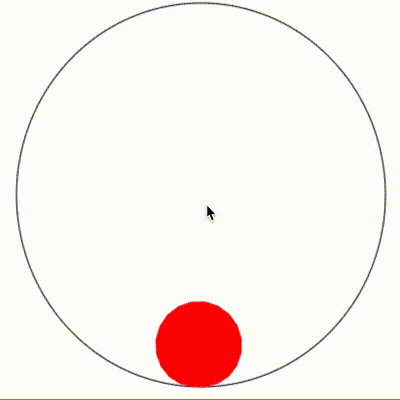

[2D Pressurized Soft Body Simulation (demo)](http://smacke.net/pressure-softbody/)
===========================================================================

An processing implementation of Maciej Matyka's soft body
[tutorial paper](http://panoramix.ift.uni.wroc.pl/~maq/soft2d/howtosoftbody.pdf).
Here is what it looks like:

    

Note: The original code was written in Java while I was in high school
and is included for the sake of completeness.
Back then I didn't know what I was doing (nor do I now), which is the reason for the single source
file, default package, magic numbers, and generally awful code. I cleaned it up a little since then, but
not by much.  Still, it is nice in that it's self-contained for anybody looking
for a terrible example of Java multithreading to manually update AWT components.

License
=======

Code is released under the FreeBSD / simplified BSD license.
